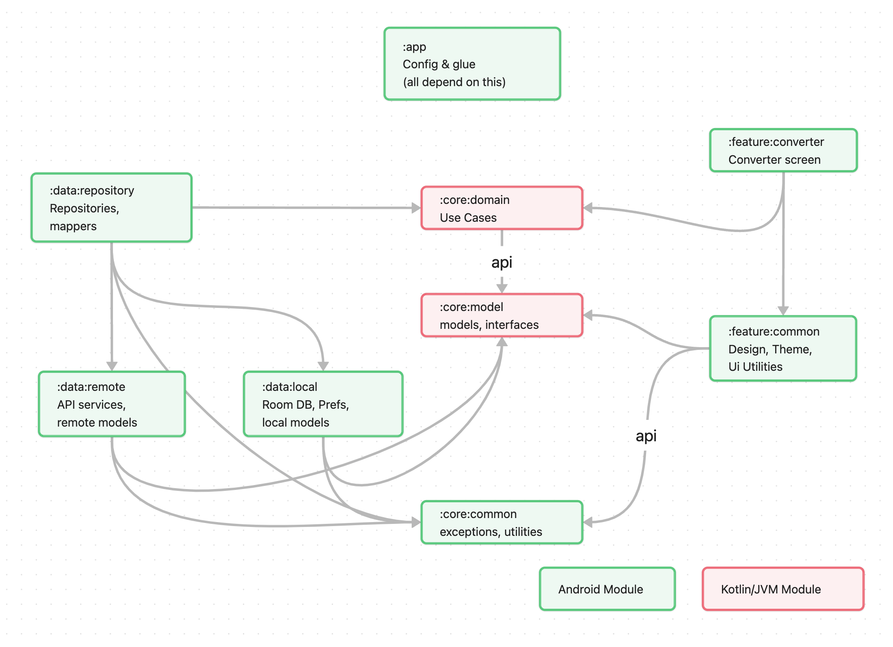

# Quick Currency

A simple currency conversion app that uses the [Currency Freaks API](https://currencyfreaks.com/). Offers a quick way to 
convert between various currencies at once. Offline capable.

## Modularisation Diagram

## Tasks

### Basic App
* [x] Set up app scaffold
* [x] Create API service for currency data
* [x] Create currency conversion functionality for main screen
* [x] Create UI for main screen
* [x] Add API method to retrieve all currencies
* [x] Create popup currency selection list
* [x] Make base currency and target currency list dynamic and stored locally
* [x] Add offline support to currency API + add rates timestamp
* [x] Add error messaging
* [ ] Set up module structure

### Improvements
* [ ] Improve currency list appearance/performance and add image caching
* [ ] Add recently used currencies to top of currency list
* [ ] Add keyboard filtering to currency selection list
* [ ] Add specific landscape layout
* [ ] Add option to toggle crypto-currency inclusion
* [ ] Add tests for use cases and repositories

### Release
* [ ] Create app icon
* [ ] Create debug build type
* [ ] Add proguard rules
* [ ] Set up handling of api key Github secret
